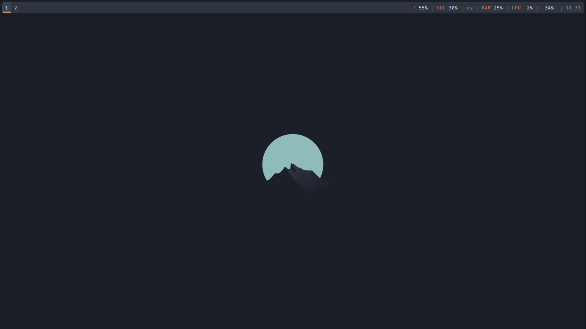
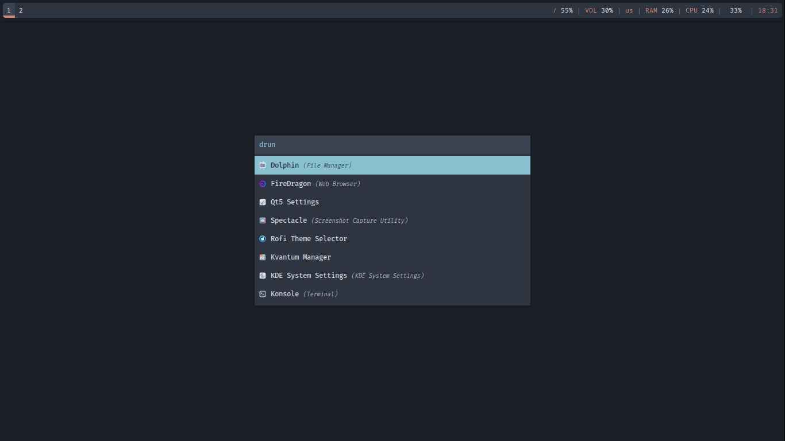
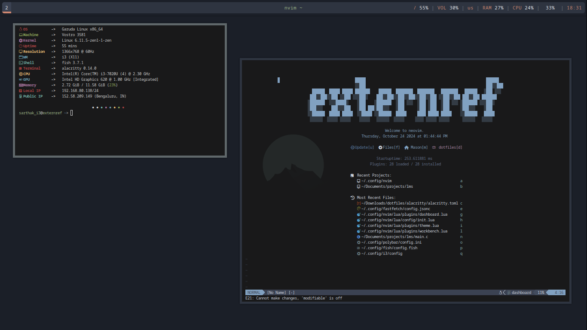
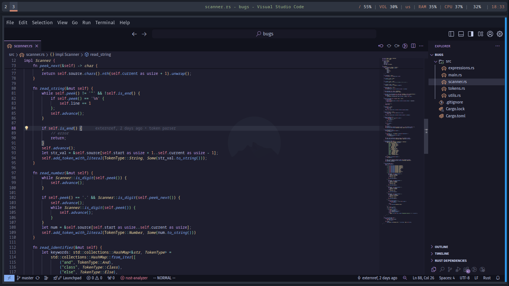
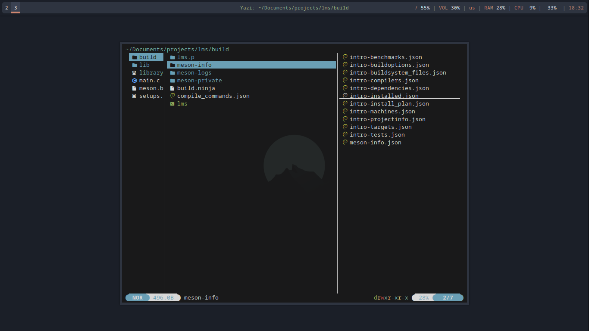

# dotfiles

My simple i3 Arch Setup.

| Image 1       | Image 2       | Image 3       |
|---------------|---------------|---------------|
|  Home| Rofi |  FastFetch & Neovim|
|  Vscode|  TUI Fex using Yazi  |               |